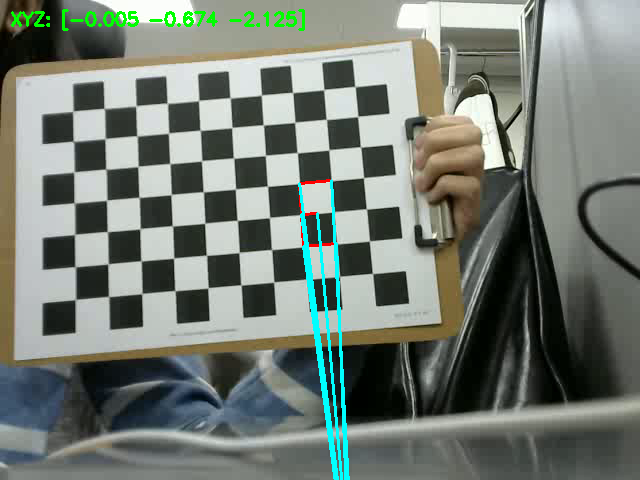

# Pose Estimation and AR

A project that estimates camera pose using calibration results and renders an AR object—a **3D number '3'**—onto a chessboard pattern in a recorded video using OpenCV.

---

## Description

This project demonstrates basic augmented reality using OpenCV and a calibrated camera.

- **Camera pose estimation** is performed using a previously computed `calibration_data.npz`.
- A **3D virtual number '3'** is rendered on top of a chessboard pattern and follows the camera view.
- The system uses `cv.solvePnP()` to determine the camera's position and orientation.
- The result is displayed in real-time and saved to `ar_output.avi`.
- A screenshot (`screenshot.png`) of the first successful AR overlay frame is saved automatically.

---

## AR Object Details

- The AR object is a **3D number '3'**, represented using a series of connected 3D points.
- It is extruded upward from the chessboard plane to create a 3D visual effect.
- The object remains fixed relative to the chessboard coordinate system and moves with camera motion.

---

## How to Run
Ensure the following files are in the same directory:
   - `recorded_video.avi` – your input video with a visible chessboard
   - `calibration_data.npz` – result from camera calibration (Homework #3)
   - `ar_pose_number3.py` – the main script

---

## AR Result Screenshot

Here is a sample result of the AR visualization:

